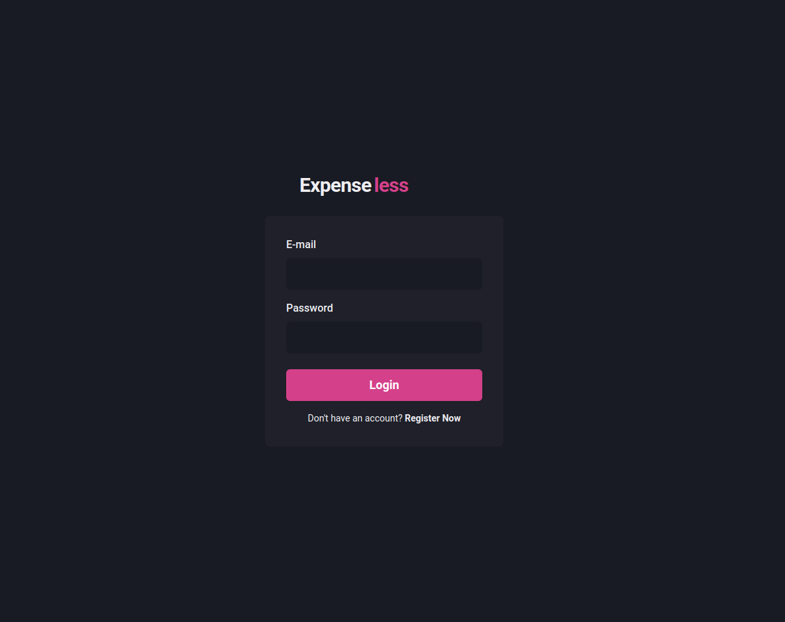
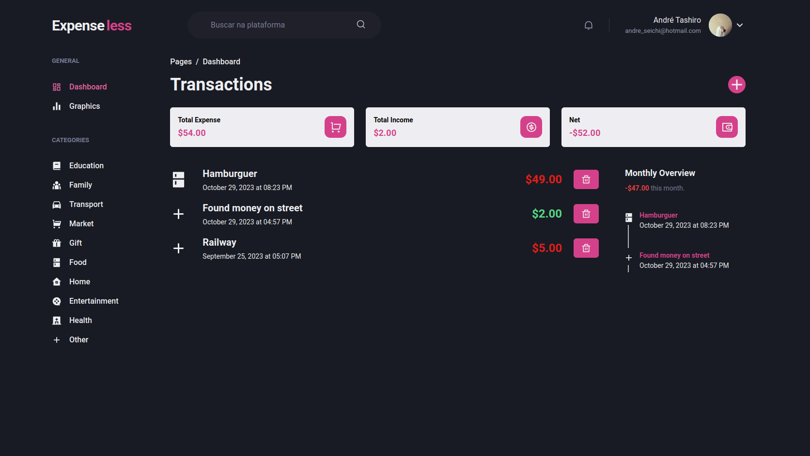

# Expense Less Dashboard

  
  

  
  

> Dashboard of money management application with own login system with JWT for more security

Check [Api repo here](https://github.com/andreseichi/expense-less-api)

**Backend is currently being hosted on free [Render](https://render.com/) plan, so sometimes it could take a while to respond D:**
